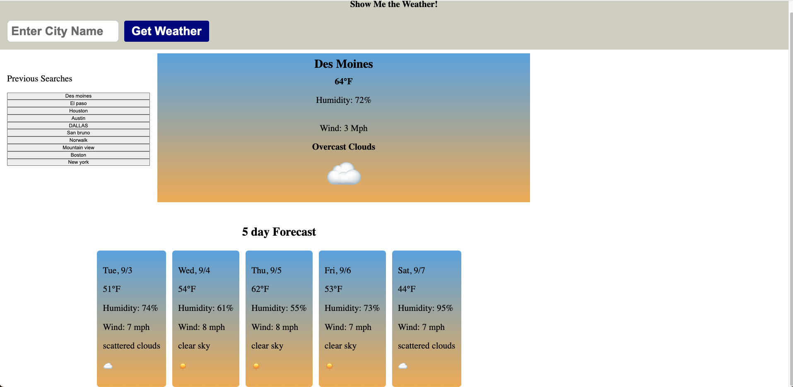

# Weather API Forecast

  

  ## Description
  This is a weather application that utilizes server side API to fetch data from the Open Weather api to display today's weather as well as the 5 day forecast for a given city

  ## URL of Deployed Application

  https://tjmcd2010.github.io/weather-api-06/

  ## Screenshot of Deployed Application

  

  ## Table of Contents
  - [Installation](#installation)
  - [Usage](#usage)
  - [Contributing](#contributing)
  - [Tests](#tests)
  - [Technologies](#technologies)
  - [License](#license)
  - [Questions](#questions)

  ## Installation
  No installation needed. Simply search for a citywafter you navigate to the url

  ## Usage
  This if an app that can be used to check the forecast for any city in the world. It will show you today's weather, as well as the 5 day forecast. 

  ## Contributing
  N/A

  ## Tests
  N/A

  ## Technologies
  
  Server-Side API, Javascript, HTML, CSS

   ## License
  MIT

  ## User Story

  AS A traveler
  I WANT to see the weather outlook for multiple cities
  SO THAT I can plan a trip accordingly
  
  ## Acceptance Criteria

  GIVEN a weather dashboard with form inputs
  WHEN I search for a city
  THEN I am presented with current and future conditions for that city and that city is added to the search history
  WHEN I view current weather conditions for that city
  THEN I am presented with the city name, the date, an icon representation of weather conditions, the temperature, the humidity, and the wind speed
  WHEN I view future weather conditions for that city
  THEN I am presented with a 5-day forecast that displays the date, an icon representation of weather conditions, the temperature, the wind speed, and the humidity
  WHEN I click on a city in the search history
  THEN I am again presented with current and future conditions for that city
 
  ## Questions

  For any additional questions or feedback, please contact me with the following information:
  Github: (https://github.com/tjmcd2010)
  Email: (mailto:tjmcd2010@gmail.com)  

